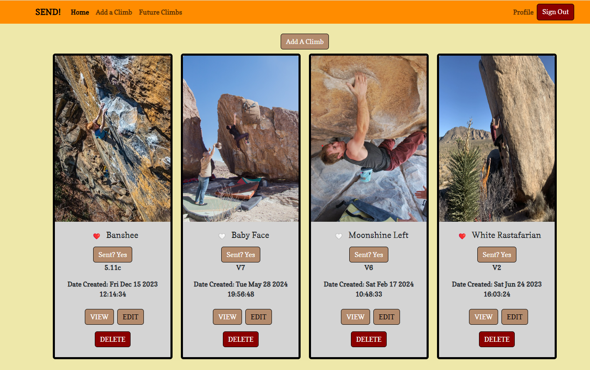
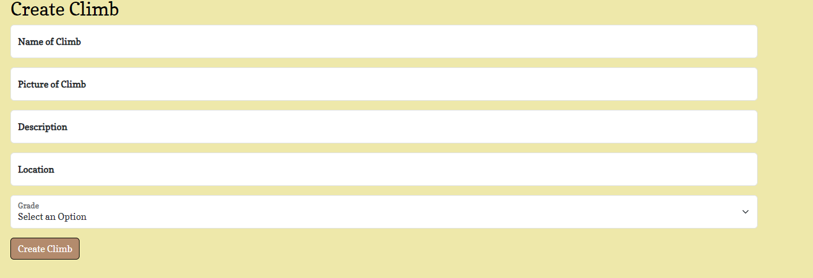

# SEND!  [[](https://sendclimbs.netlify.app)]

## App Overview
SEND! is an application that allows a user to view climbs they have sent and create climbs once the user has sent them. 

## About the User
- The ideal user for this application is a rock climber
- Rock climbers climb many routes and many of them have unique names. Each route has it's own grade. 
- The problem this app solves for them is it allows them keep track of the climbs they have sent and keep track of their progress because they will see the grade of the routes they are climbing.

## Features
- When a new climb is added an object should be created and that object should be pushed into an array of climbs that then prints to the DOM.
- Future limbs: The user is able to toggle whether they have sent the climb or not. If they have not sent it, the climb print on to the 'Future Climbs' page. 
- Delete and Editing: The user is able to delete any climbs they have created or edit them. 
- Favorite: The user is able to favorite a climb by toggling a heart on the climb. 
- User is able to navigate the application through the navigation bar with different tabs to pages
- The logo or initials in the navigation bar takes the user back to the home view. 
- The user can navigate to a profile page, that show's the user's who is currently logged in information
- The user can see details of each climb by clicking the view button which includes: description, grade, image, name, and location of the climb

## Video Walkthrough of SEND!
https://www.loom.com/share/0dbaccddf11740509bb98f1bcb45b916?sid=586f31b3-a46f-4c30-a636-0a990ea07cfb

## Relevant Links
- [Check out the deployed site](https://sendclimbs.netlify.app)
- [Wireframes] (https://docs.google.com/presentation/d/1dpxeQzmib42BmvDqdywn-r5aABlPVjSdy3TPu7vpkUU/edit?usp=sharing)
- [Project Board] (https://github.com/users/rossm933/projects/3/views/1)
- [ERD] (https://dbdiagram.io/d/CAPSTONE-FE-6642a0d69e85a46d55c05b9a)

## Project Screenshots 

## Contributors
- [Ross Morgan](https://github.com/rossm933)
